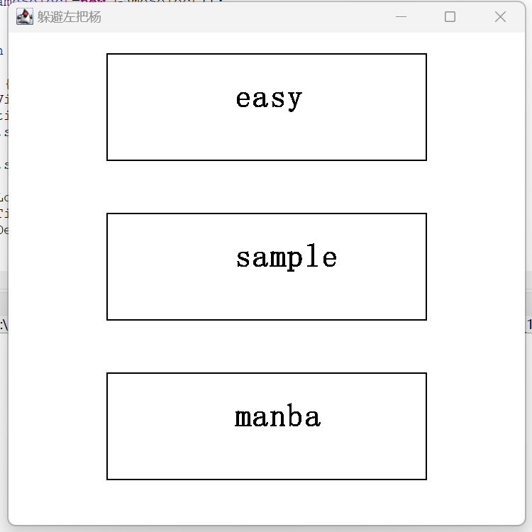
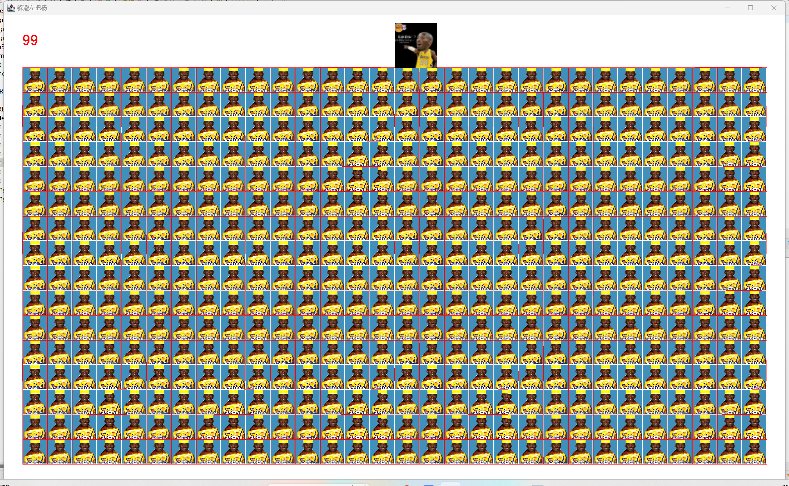
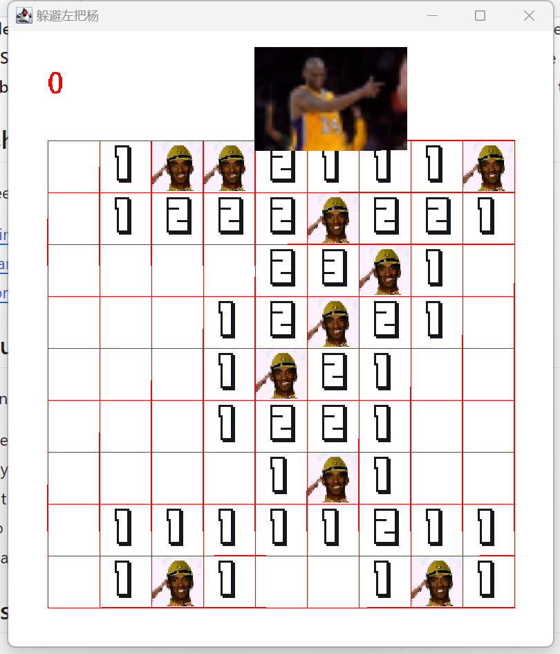

# Escape from Zobayan

## Project Overview
"Escape from Zobayan" is an enhanced Java-based implementation of the classic Minesweeper game with an adventurous twist. Set in the mysterious world of Zobayan, players must clear mines to escape from a perilous landscape. The game challenges players with multiple levels of difficulty to test their deductive reasoning and quick thinking.

## Technology Stack
- **Programming Language**: Java
- **Graphical Interface**: Utilizes Java's Abstract Window Toolkit (AWT) and Swing library for robust user interaction and graphical representation.

## Installation Guide
Get started with "Escape from Zobayan" by following these steps:

### Prerequisites
Ensure the Java Development Kit (JDK) is installed on your computer. If not, download it from Oracle's official website.

### Steps
1. **Clone the repository:**
git clone https://github.com/software-enginenering-project/escape-from-zobayan.git

2. **Navigate to the project directory:**
cd escape-from-zobayan

3. **Compile the source code:**
javac GameWin.java

4. **Run the game:**
java GameWin

## Usage Instructions
- **Starting the Game**: Launch the game from the executable or command line.
- **Gameplay**:
- **Left-click** on a tile to uncover what lies beneath.
- **Right-click** on a tile to mark it if you suspect there's a mine (danger).
- **Difficulty Levels**: Select from Easy, Medium, or Hard to adjust the challenge based on your skills.

## Features
- **Themed Gameplay**: Immerse yourself in the Zobayan realm where each click can mean the difference between escape and peril.
- **Multiple Difficulty Settings**: Tailored challenges to suit beginners to advanced players.
- **Timed Sessions**: Enhance your quick decision-making skills under pressure with the timer feature.
- **Leaderboard**: Compete with other players by recording your top scores and fastest times.

## Screenshots
Include screenshots of the game:
- 
- 
- 

## Project Member Contributions:
-**P2211487 Tecca xiao:**
Writing the read.me file, Establish the github project structure

-**P2211323 Dean zhang:**
Writing the code of project

-**p2211565 Lucius Yu:**
help to finish the project, complete the demo and edit the video.

## Troubleshooting
For common problems, refer to the FAQ section. For unresolved issues, submit an issue on GitHub.

## Demostration
The demo for how to use this applicaiton is uploaded in youtube:https://youtu.be/Zosms0-UNgM
## Contact
For further information or support, reach out via email at [p2211323@mpu.edu.mo] or check out our [GitHub repository](https://github.com/software-enginenering-project/escape-from-zobayan).

